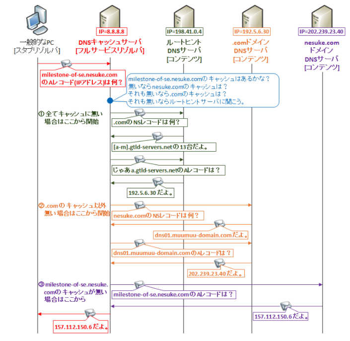

## ブラウザが Webページを表示するまで
https://laboradian.com/create-web-page-show-your-info/#i-8
    
    TCP/IP
        現在のインターネットでは、このプロトコルが使用されています

    World Wide Web (WWW, Web)
        インターネット上で HTML文書をやりとりするためのシステムです。

#### URLを指定してアクセスする
#### 1. DNS によりホスト名からIPアドレスが取得される

        laboradian.com は、comの部分がトップレベルドメインで、
        laboradian が第二レベルドメインになりますが、
        実際はその上にルートドメインというのがあります。上位のドメインが下位のドメインを管理
        1. ルートドメインDNSサーバーに、comドメインを管理しているDNSサーバー(IPアドレス)を教えてもらう。
        2. comドメインを管理するDNSサーバーにアクセスし、laboradianドメインを管理するDNSサーバー(IPアドレス)を教えてもらう。
        3. laboradianドメインを管理するDNSサーバーにアクセスし、ホスト misc のIPアドレスを教えてもらう。

#### 2. Webサーバーの 80番ポートに対してHTTPリクエストメッセージを送信する
        
        ブラウザとWebサーバーのやりとりにはHTTPというプロトコルが利用され、TCP/IPの上のレイヤで行われます。
        「上のレイヤ」といっても、実際には TCP/IPのデータの中に、HTTPのデータが包み込まれた形で通信が行われます
        
        ルータは、RIP や OSPF 等のダイナミックルーティングと呼ばれるルーティングテーブルの自動学習プロトコルを使って
        ルーティングテーブルを自動管理している。ダイナミックルーティングでルーティングテーブルを構成していれば、
        途中通信できない区間が出ても、動的に経路を変更して目的地に到達することが出来る
        

#### 3. Webサーバーが HTTPリクエストメッセージを受け取る
        
        Webサーバーには、ドキュメントルート という設定値をもとに要求されたファイルを探します。
        
        コンテントネゴシエーション
            リクエストのメッセージヘッダで指定されたメディアタイプ、 言語、エンコーディングなどに基づいて、 
            最適な形でレスポンスを返そうとする Webサーバー側の処理
        
#### 4. PHPの処理が実行される
        
        ファイルの拡張子が phpの場合、これは PHPの実行エンジンが処理すべきファイルであると判断し、
        PHP実行エンジンに処理を任せます
        PHP実行エンジンは、index.php を受け取って中身を解釈し、その結果を Webサーバーに返し、
        Webサーバーはそれをブラウザに返すのです。

#### 5. Webサーバーが HTTPレスポンスメッセージを返す
        
        ブラウザから要求された index.php ファイルが PHP実行エンジンにより処理され、
        その結果が、HTTPプロトコルのレスポンスメッセージとなって、ブラウザに返されます。

#### 6. 取得したHTMLを描画する

